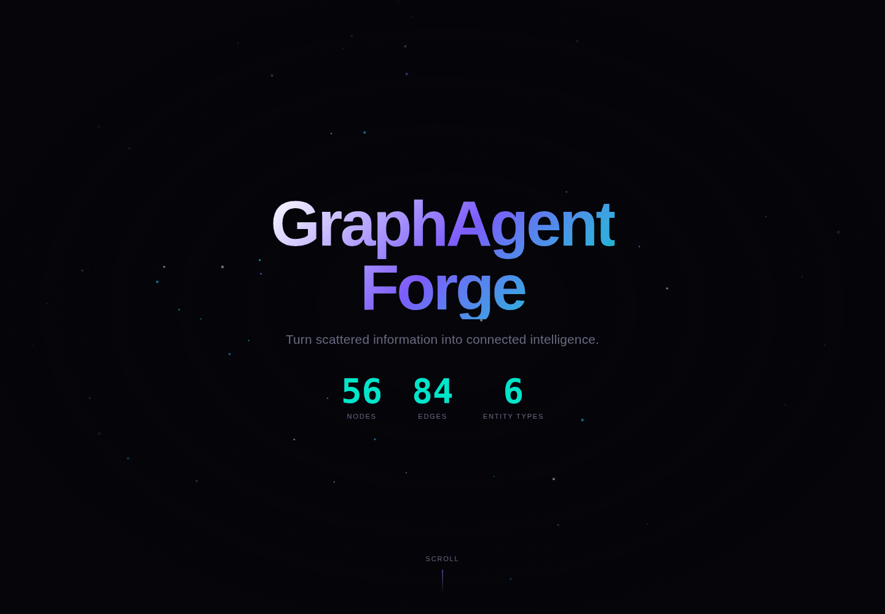
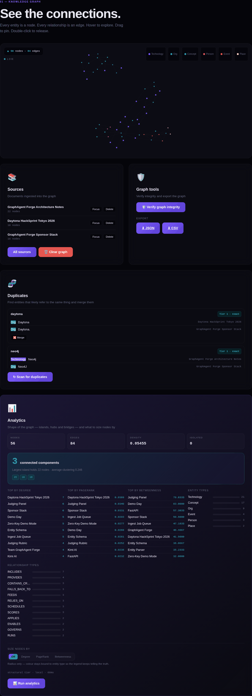
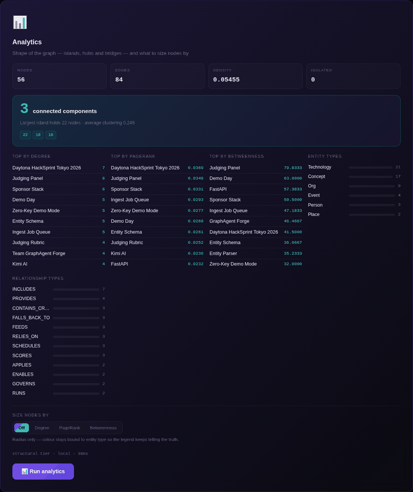
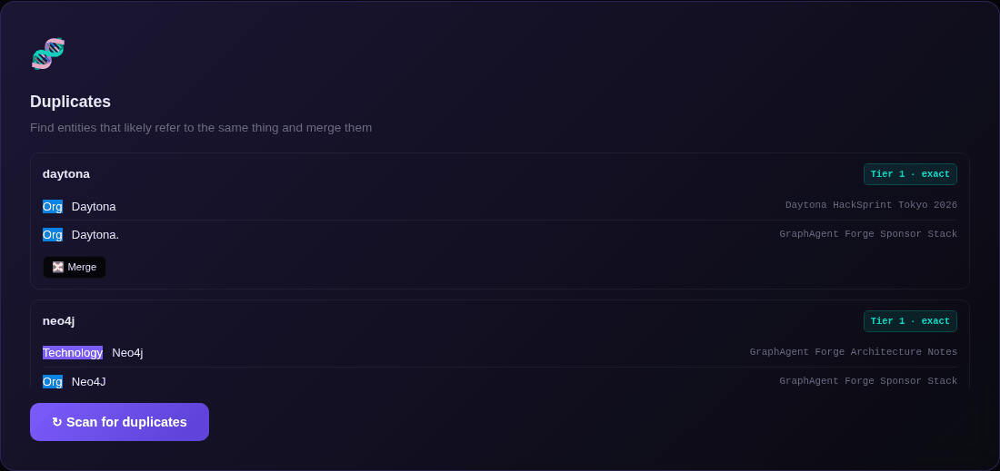
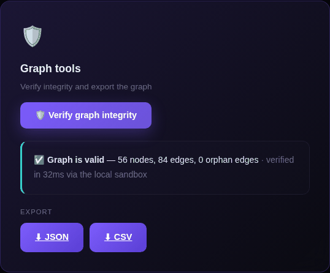
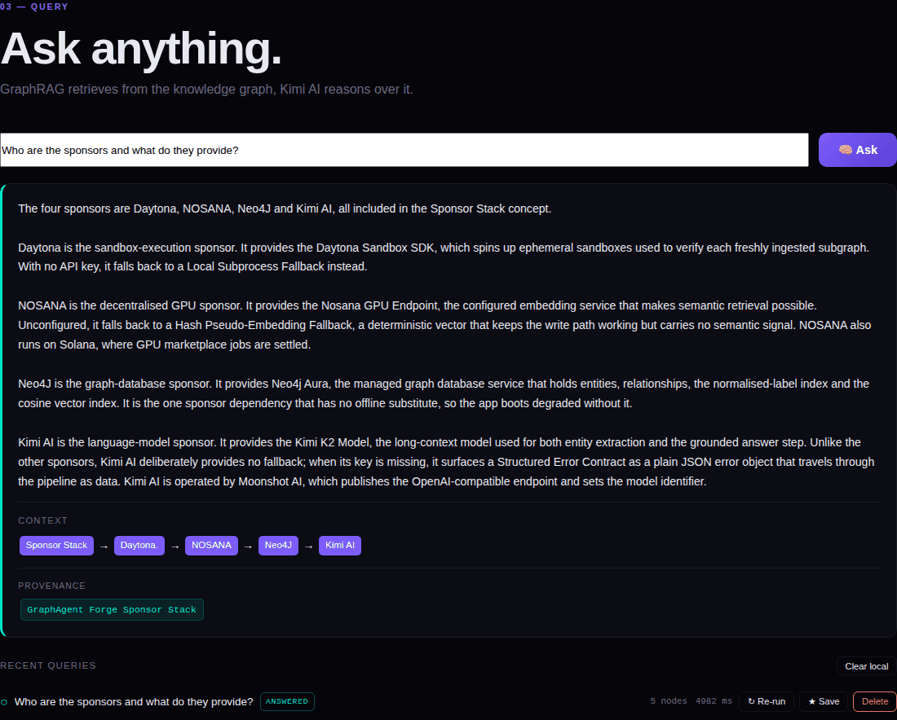
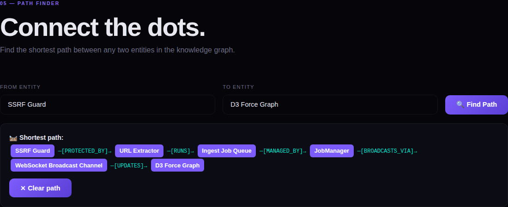

# 🧠 GraphAgent Forge

> Turn scattered information into connected intelligence.

[](https://github.com/nvmmonsalud/graphagent-forge/actions/workflows/ci.yml)

GraphAgent Forge is an autonomous AI agent that ingests unstructured data,
builds knowledge graphs, and reasons over them using GraphRAG. Built for the
Daytona HackSprint Tokyo (Sept 12, 2026).

## 🏗️ Architecture

```
┌──────────────┐    ┌──────────────┐    ┌──────────────┐
│   User URL   │───▶│  Ingestion   │───▶│  Kimi (LLM)  │
│  or Document │    │  Pipeline    │    │  (Extract)   │
└──────────────┘    └──────────────┘    └──────┬───────┘
                                               │
                                               ▼
┌──────────────┐    ┌──────────────┐    ┌──────────────┐
│   Web UI     │◀──▶│  GraphRAG    │◀──▶│   Neo4j      │
│ (D3/FastAPI) │    │  Query Eng.  │    │  (Graph DB)  │
└──────────────┘    └──────────────┘    └──────────────┘
                           │
                           ▼
                    ┌──────────────┐    ┌──────────────┐
                    │   Daytona    │    │    Nosana    │
                    │  (Sandboxes) │    │  (GPU Jobs)  │
                    └──────────────┘    └──────────────┘
```

## 🔧 Sponsor Integration

| Sponsor | Role | Integration |
|---------|------|-------------|
| **Kimi AI** | Reasoning & extraction LLM | Kimi (`kimi-k2.7-code-highspeed` by default; override with `KIMI_MODEL`) — OpenAI-compatible API; inputs are clipped to 50,000 characters (`MAX_CHARS`) before extraction |
| **Neo4j** | Knowledge graph storage & GraphRAG | Cypher queries, vector search |
| **Daytona** | Isolated agent execution sandboxes | Isolated sandbox execution of the graph-integrity check — a Daytona sandbox when `DAYTONA_API_KEY` is set, a local subprocess otherwise. The verify response reports which path ran (`method`) and the measured wall time (`duration_ms`, plus `boot_ms` for sandbox creation) |
| **Nosana** | Decentralized GPU compute | GPU embeddings via a configurable `NOSANA_EMBEDDING_URL`, with a deterministic 384-dim hash fallback so the app runs keyless. Semantic (tier-2) duplicate detection turns itself on only when real embeddings exist |

## 👀 See it running


*The landing view — particle field, live counters for entities, relationships and source documents.*


*The full Knowledge Graph section: a force-directed layout with every node in frame, plus the Sources, Graph tools, Duplicates and Analytics panels alongside it.*


*Graph analytics: connected-component breakdown, entities ranked by degree/PageRank/betweenness, and entity- and relationship-type histograms.*


*Suggest-only duplicate detection — exact-label groups shown with per-node provenance, merged only on explicit confirmation.*


*Graph-integrity verification, run in the local sandbox — structural checks like orphan-edge detection, independent of any LLM.*


*Ask a question with a Kimi key configured: GraphRAG retrieves and ranks entities, fetches their graph neighbourhood, and Kimi writes an answer grounded only in that context — with the retrieved entities and source provenance shown beneath it. Keyless, the same view still runs retrieval and shows what it found, with a notice in place of the written answer.*


*Path finding between two entities, with the relationship type at each hop along the way.*

## 🚀 Quick Start

```bash
# 1. Install dependencies
pip install -r requirements.txt

# 2. Configure environment
cp .env.example .env
# Edit .env with your API keys (the app boots with none configured,
# in a degraded mode — KIMI_API_KEY is needed for extraction/answers)

# 3. Run the app
python -m src.main
# alternative: ./run.sh  (creates .venv, installs deps, starts the server)

# 4. Open the web UI
open http://localhost:8000

# Optional: seed a demo graph (3 sample documents) instead of ingesting live
python -m scripts.seed_graph
```

The web UI's force graph is rendered with D3, served locally from `/vendor`
(`frontend/vendor/d3.v7.min.js`) — no CDN access needed for the graph to render.

Or with Docker (bundles Neo4j):

```bash
docker compose up
```

Optional Streamlit dashboard (a secondary view, separate from the web UI above):

```bash
streamlit run frontend/app.py    # API base via GRAPHAGENT_API env var
```

Development:

```bash
pip install -r requirements-dev.txt
ruff check src/ tests/     # lint (configured in pyproject.toml)
pytest                     # offline test suite — no keys or Neo4j needed
pytest -m integration      # extra tests against a live Neo4j (reads NEO4J_* env)
```

## 📁 Project Structure

```
graphagent-forge/
├── src/
│   ├── main.py              # FastAPI app entry point, WebSocket manager, lifespan
│   ├── agent/
│   │   ├── core.py          # Main agent loop (ingest/ask orchestration, progress stages)
│   │   ├── jobs.py          # Async ingest job queue (JobManager, submit/wait/list)
│   │   ├── daytona_exec.py  # Daytona sandbox execution (local subprocess fallback)
│   │   ├── nosana_client.py # Nosana GPU embeddings (hash fallback)
│   │   └── history.py       # In-memory query/answer history store
│   ├── graph/
│   │   ├── neo4j_client.py  # Neo4j connection, schema & queries
│   │   ├── graphrag.py      # GraphRAG query engine
│   │   └── normalize.py     # normalize_label() for norm_label / dedup matching
│   ├── ingestion/
│   │   ├── extractor.py     # URL/document content extraction (SSRF-guarded)
│   │   ├── file_extractor.py# Uploaded-file extraction (PDF/TXT/MD, magic-byte checks)
│   │   ├── entity_parser.py # Kimi-powered entity extraction & answering
│   │   └── graph_writer.py  # Write entities to Neo4j
│   └── api/
│       └── routes.py        # FastAPI endpoints (/api/*)
├── frontend/
│   ├── index.html           # Primary web UI (D3 graph, served at /)
│   ├── app.py               # Optional Streamlit dashboard
│   └── vendor/
│       └── d3.v7.min.js     # D3, served locally — no CDN needed to render the graph
├── scripts/
│   ├── seed_graph.py        # Loads seed/graph.json into Neo4j for demos
│   └── capture_ui.py        # Playwright + Pillow script that captures assets/ui/*.png from a live server
├── seed/
│   └── graph.json           # Sample multi-document graph fixture
├── assets/
│   └── ui/                  # UI capture PNGs referenced from README.md
├── tests/                   # Offline unit/route tests + Neo4j integration tests
├── .github/                 # CI workflow (ruff + offline pytest)
├── .env.example             # Environment template
├── .dockerignore            # Docker build context excludes
├── requirements.txt         # Runtime dependencies
├── requirements-dev.txt     # Dev/test dependencies
├── pyproject.toml           # ruff + pytest configuration
├── Dockerfile               # App image
├── docker-compose.yml       # App + Neo4j
├── run.sh                   # Convenience script: venv + deps + start server
├── CLAUDE.md                # Guidance for Claude Code when working in this repo
├── DEMO_PITCH.md            # 2-minute demo script
├── LICENSE                  # MIT
└── README.md                # This file
```

## 🔌 API Highlights

All endpoints under `/api`.

**Ingest is async — a job queue, not a synchronous call.** `POST /ingest/url`,
`POST /ingest/text`, and `POST /ingest/file` (multipart upload; PDF/TXT/MD, 3MB
cap) all return `202` immediately with `{"job_id", "status"}`; two background
workers pull from an in-memory queue and run the pipeline, reporting stage
transitions (`fetching`/`parsing` → `extracting` → `embedding` → `merging`
→ `broadcasting` → `verifying`) live over `WS /ws/graph` as
`{"type": "job_update", "job": {...}}`. Poll `GET /api/jobs/{id}` or list
recent jobs with `GET /api/jobs?limit=`, or pass `?wait=true` on any ingest
route to block and get the final result synchronously instead (still subject
to `INGEST_JOB_TIMEOUT`, default 600s, which caps how long a single job may
run before it's failed with `"timed out"`).

Query: `POST /ask`, `POST /graph/search`, `POST /graph/path`. Graph data:
`GET /graph/data[?source_doc=][&limit=]` (node cap 1–5000, default 500, on
the all-sources view only — a per-source read is never truncated), `GET
/graph/stats`, `GET /graph/verify`, `POST /graph/verify/fanout`,
`POST /graph/verify/sweep`,
`GET /graph/export?format=json|csv`.
Source management: `GET /sources`, `DELETE /sources?source_doc=`, `POST
/graph/clear`. Duplicate entities across sources are surfaced by `GET
/graph/duplicates` and merged via `POST /graph/merge` (suggest-only; set
`AUTO_MERGE=exact` to auto-merge exact matches at ingest). Live updates
stream over `WS /ws/graph`. Optional hardening via env: `API_KEY`
(X-API-Key auth on mutating routes), `ALLOWED_ORIGINS` (CORS). Ingest and
ask share one rate-limit bucket per IP, `RATE_LIMIT_MAX` requests (default
10) per 60s.

`GET /graph/analytics?top=` returns two tiers in one response: a Cypher tier
(`totals`, `node_types`, `edge_types`, `top_degree`) that's always available,
and a `structure` tier (connected components, PageRank, betweenness, average
clustering) computed in the Daytona sandbox or its local fallback. When the
structural run can't happen, `structure` degrades in place to `{"ok": false,
"error": ...}` with no metric keys rather than failing the whole request —
the same precedent `tier2_reason` sets on `/graph/duplicates`.

`POST /graph/verify/fanout[?limit=1-16]` audits every source's sub-graph in
its **own** Daytona sandbox, all launched together: N sources spawn N sandboxes
concurrently (bounded by `FANOUT_MAX_CONCURRENCY`, default 6), so the run's
wall clock is bounded by the slowest single audit instead of their sum. It
reads the per-source payloads from Neo4j, hands them to the executor's
`verify_graph_fanout` with an injected broadcast sink, and streams each
sandbox's lifecycle over `WS /ws/graph` as `{"type": "fanout_update", "phase":
"started"|"done", ...}` so the audit is watchable while it runs. The response
reports measured `wall_ms`, `serial_ms`, `speedup`, `sandbox_count` and boot-time
stats; each entry in `sources` carries its own verdict, so one source failing
never fails the batch, and a run in which nothing produced a verdict returns
`{"ok": false, "error": ...}` with no `sources` key at all.

`POST /graph/verify/sweep` takes the fan-out one step further: `{"sizes": [1, 3,
6, 10]}` (default when no body is sent) runs the SAME sub-graph through 1, 3, 6
and 10 sandboxes in turn and returns the measured pair for each size. Sizes run
**sequentially on purpose** — every sandbox draws on the same account CPU budget,
so overlapping them would slow both batches down and the curve would stop meaning
anything. The payload is **replicated**, not N distinct documents, and the
response says so (`replicated: true`, `distinct_sources: 1`, plus the payload's
own node and edge counts) so a result can never be misread as an audit of N
crawled sources. Each entry also carries `short_by` (`n - sandbox_count`): a
positive value means the account refused sandboxes at its concurrent-CPU ceiling,
which is surfaced rather than averaged away. Same two-shape envelope and fixed
error literal as the fan-out, and the same injected broadcast sink, streaming
`{"type": "sweep_update", "phase": "size_started"|"size_done", "n": ..., ...}`
so the chart draws itself as each size lands.

The query-history panel is backed by `GET /history?limit=`, `POST
/history/{id}/save`, `DELETE /history/{id}/save`, and `DELETE /history/{id}`.
The store is in-memory on the server (answered questions, not the graph
itself) and reset by a restart; the frontend keeps a capped localStorage
mirror so the panel still shows something afterwards, per browser.

## 🎯 Judging Criteria Alignment

| Criterion | How We Win |
|-----------|-----------|
| **Completeness** | Full pipeline: ingest → extract → graph → query → web UI |
| **Innovation** | GraphRAG + autonomous agent = novel reasoning over connected data |
| **Real problem** | "Make sense of scattered info" — universal pain point |
| **Sponsor usage** | All 4 sponsors integrated naturally |

## 📝 License

MIT — built with ❤️ for Daytona HackSprint Tokyo 2026
